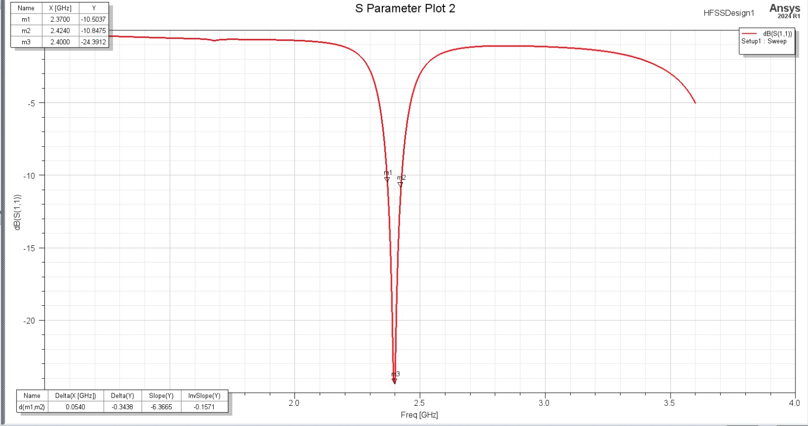
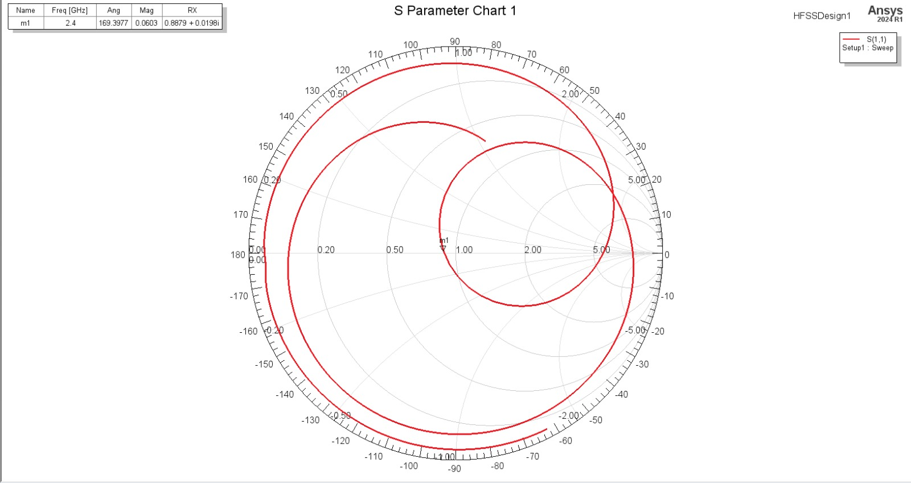
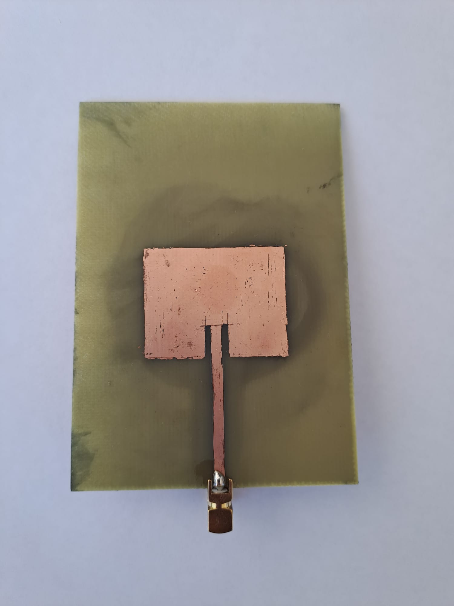

# 2.4 GHz Rectangular Patch Antenna: Simulation and DIY Fabrication

This repository documents the design, HFSS simulation, and at-home DIY fabrication of a 2.4 GHz rectangular inset feed patch antenna. The project validates the theoretical model by comparing the simulated Ansys HFSS results against real-world physical measurements captured using a Vector Network Analyzer (VNA).

## Design Overview
The antenna is designed using an inset feed mechanism matched to a 50-ohm SMA connector. 

* **Operating Frequency:** 2.4 GHz
* **Feeding Method:** Inset microstrip line
* **Substrate Material:** FR4
* **Dielectric Constant (εr):** ~4.4
* **Substrate Thickness:** 1.6 mm

**1. HFSS Antenna Model**  

## Simulation vs. Physical Measurement

Both simulated data (Ansys HFSS) and measured data (VNA) are provided below to demonstrate the accuracy of the DIY fabrication.

### Return Loss (S11)
The S11 parameters show the resonance frequency and bandwidth alignment between the simulation and the physical board.

* **HFSS Simulated S11:** -24.39 dB

**2. HFSS Simulated S11 Graph**  

* **VNA Measured S11:** [Insert measured minimum S11 value, e.g., -18 dB at 2.39 GHz]

**3. VNA Measured S11 Graph**  

### Smith Chart
The Smith Charts illustrate the impedance matching of the inset feed at the target frequency, comparing the ideal software environment to the real-world etched board.

**4. HFSS Simulated Smith Chart**  

**5. VNA Measured Smith Chart**  

## DIY Fabrication
The physical prototype was manufactured at home. 
* **Method:** Chemical Etching
* **Connector:** Edge-mounted female SMA connector soldered directly to the feed line and ground plane.

**6. Physical Prototype**  

## Repository Contents
* `2.4GHz_patch_antenna_Archive.aedtz` - The archived Ansys Electronics Desktop project file (Simulation results excluded for file size limits).
* `/images/` - Directory containing all S-parameter exports, Smith charts, and physical photos.
